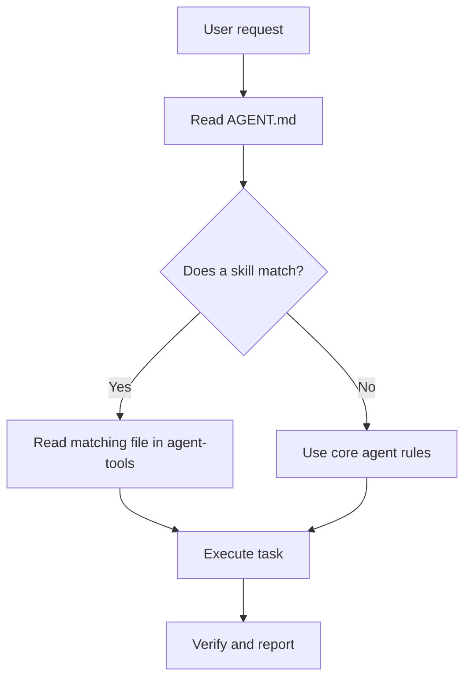

# Superskills

> Personal agent instructions and skill rules for focused, evidence-first coding work.

## Overview

Superskills is a small instruction library built around one main agent file:

- `AGENT.md` defines the core agent behavior.
- `agent-tools/` contains focused skill files loaded only when needed.

The goal is to keep the main agent instructions clean while moving detailed workflows into separate markdown files.

## Structure

```text
Superskills/
├── AGENT.md
└── agent-tools/
    ├── caveman.md
    ├── code-review.md
    ├── debugging.md
    ├── documentation.md
    ├── github-commit.md
    ├── graphify.md
    ├── javascript-typescript.md
    ├── minimal-ui-ux.md
    ├── python.md
    ├── research.md
    └── skill-adder.md
```

## How It Works

`AGENT.md` gives the agent its default operating style:

- think before coding
- keep changes simple
- make surgical edits
- define success criteria
- use linked skills only when needed

When a task matches a skill, the agent should read that skill file and follow its rules.



## Skills

| Skill | Use For |
|---|---|
| `graphify.md` | Knowledge graphs, architecture maps, codebase relationships |
| `caveman.md` | Compressed, low-token communication |
| `python.md` | Python repos, especially `uv` workflows |
| `javascript-typescript.md` | JS/TS repos using Bun, npm, Biome, tests, builds |
| `github-commit.md` | Detailed commit messages from real diffs |
| `code-review.md` | Bug, regression, security, and missing-test reviews |
| `skill-adder.md` | Adding new skills correctly |
| `minimal-ui-ux.md` | Clean, accessible, minimal UI/UX work |
| `debugging.md` | Evidence-first debugging and root-cause isolation |
| `documentation.md` | READMEs, runbooks, diagrams, API docs, changelogs |
| `research.md` | Source-backed research, comparisons, and current facts |

## Adding A Skill

Use `agent-tools/skill-adder.md`.

Every new skill should:

- add one bullet under `## Skills` in `AGENT.md`
- create one focused file in `agent-tools/`
- be researched before writing
- keep detailed instructions out of the main file

## Notes

- There are no build or install commands for this project.
- There are no secrets or environment variables required.
- This repo is documentation-only unless future tooling is added.
